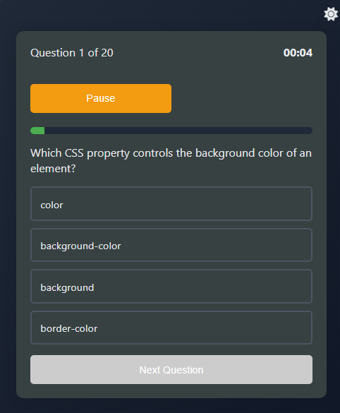
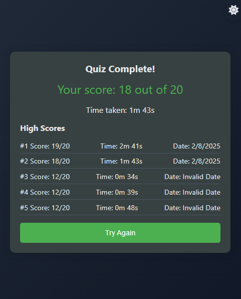

# Quiz App 🎯

A **responsive and interactive** quiz application built with **HTML, CSS, and JavaScript**. It features **dynamic questions from a JSON file**, **a start screen**, **shuffling questions & options**, **a timer with pause & resume functionality**. The app also includes **a theme toggle** for light and dark mode.

---

## 🚀 Features

- 🎨 **Engaging Start Screen** – A visually appealing start screen.
- 🔄 **Shuffled Questions & Answers** – Makes the quiz unpredictable.
- 📂 **Fetch Questions from JSON** – Uses the Fetch API to load questions.
- ⏳ **Pause & Resume Timer** – Allows users to pause and continue.
- 📊 **Progress Indicator** – Shows quiz progress visually.
- 🌗 **Light & Dark Mode** – Theme toggle for better accessibility.
- 📱 **Fully Responsive** – Works on mobile, tablet, and desktop.

---

## 📸 Screenshots

### 📍 Start Screen  


### 📍 Quiz in Progress  


### 📍 Results Page  


---

## 🛠️ Technologies Used

- **HTML5** – Structure of the app
- **CSS3** – Styling & animations
- **JavaScript (ES6)** – Logic & interactivity
- **Fetch API** – Retrieving quiz questions from a JSON file
- **Font Awesome** – Icons for theme toggle

---

## 📦 Installation

1. **Clone the repository**
   ```sh
   git clone https://github.com/xylemic/quiz__app.git
